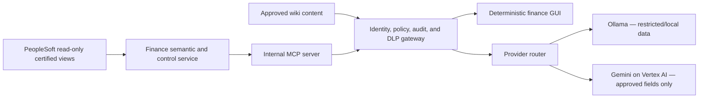

# PeopleSoft Trial Balance MCP — Corrected Review Comments

**Review date:** 2026-07-29  
**Reviewed repository:** `/Users/jalaj/peoplesoft_tb_mcp`  
**Scope:** Trial balance, ledger math, journal drill, integrity checks, trees, wiki context, stdio MCP, Ollama, Gemini on Vertex AI, production readiness, ROI, and GUI design.

This review supersedes the earlier AP/Billing-oriented review of
`/Users/jalaj/Documents/peoplesoft_mcp`. This repository does not currently
implement PeopleSoft Billing or customer-level analytics. Billing, AR, and the
top-20-customer experience are therefore treated only as a future module
roadmap, not as present capability.

## Executive verdict

This is a credible **single-user trial-balance pilot** with useful deterministic
finance logic and a real MCP client/server boundary. It is not yet safe to use
as a shared production finance service.

What is genuinely working:

- The SQLite smoke suite passed all 28 checks.
- The stdio MCP probe started the server, discovered 17 tools, and successfully
  called trial-balance, integrity, wiki, and SQL tools.
- The core reviewed Python modules compile.
- Both Ollama and Gemini/Vertex provider adapters exist, and their packages
  import in the current virtual environment.

What is not yet working or proven:

- The bundled chat host fails with the installed MCP 2.0.0 SDK before either
  Ollama or Gemini initializes.
- No live Ollama or Gemini end-to-end answer was therefore proven.
- The sample covers one BU, one ledger, one currency, a 12-period calendar, and
  a simple tree. It does not certify real PeopleSoft multicurrency, multibook,
  closing, security, scale, or effective-dated behavior.
- There is no GUI, shared service gateway, user authorization, durable audit
  trail, or production deployment package.

The highest ROI path is to make the deterministic TB workbench and close-control
experience trustworthy first. Chat should assist that workflow; it should not
be the primary control surface for financial amounts.

## Verification performed

| Check | Result |
|---|---|
| `scripts/smoke_test.py` | PASS — 28/28 checks |
| `scripts/mcp_probe.py` | PASS — 17 tools over real stdio MCP |
| Reviewed module compilation | PASS |
| Installed SDK | `mcp 2.0.0` |
| Bundled `pstb.client.chat --ask ...` | FAIL — uses MCP 1.x camelCase field `inputSchema` |
| View mode with `group_by=FUND_CODE` | FAIL — `XX_TB_BAL_VW` lacks `FUND_CODE` |
| Empty/nonexistent ledger scope | FAIL SAFE TEST — returns `in_balance=true` and `clean=true` |
| Account balance with `through_period=998` | FAIL — adjustment is included and then added a second time |
| Historical FY2025 account description | Uses the rename effective in FY2026, proving “as of today” behavior |

## Review findings

### P0 — Fix before another user relies on the answer

#### 1. The bundled Ollama/Gemini host is broken with MCP 2.0

`pyproject.toml:10-15` allows `mcp>=1.2.0`, and `pstb/server.py:14-17`
explicitly supports the 2.0 server import. However,
`pstb/client/chat.py:48-58` and `pstb/client/chat.py:103-106` read the old
camelCase fields `structuredContent`, `isError`, and `inputSchema`.

With the installed MCP 2.0.0 SDK, tools expose `structured_content`,
`is_error`, and `input_schema`. The current chat command fails at tool discovery:

```text
AttributeError: 'Tool' object has no attribute 'inputSchema'
```

The MCP probe did not catch this because it reads tool names but does not build
the provider `ToolSpec` list. Add a compatibility adapter or pin one SDK major,
then make both host versions part of CI. Add one end-to-end golden test per
provider that starts the server, discovers schemas, calls tools, and produces a
numerically verified answer.

#### 2. “No data” can be presented as a clean, balanced ledger

`pstb/engine.py:252-315` calculates zero totals on an empty result and marks
`in_balance=true`. `pstb/engine.py:518-582` then marks a nonexistent
BU/year/ledger scope `balanced=true` and `clean=true`.

This is a dangerous false assurance for close and audit work. A zero-row result
must return a distinct state such as `no_data` or `scope_not_found`; it must
never return “clean.” Validate BU, ledger, fiscal year, period, data freshness,
and expected row population before running integrity controls.

#### 3. Currency and amount basis are not production-safe

`defaults.base_currency` is configured in `pstb/config.py:15-25` and shown to
the model, but the engine does not apply it. `pstb/queries.py:96-121` adds a
currency predicate only when the caller explicitly supplies one. Most tools,
including account balance, comparison, integrity, and tree rollup, have no
currency/basis argument at all.

Consequently, rows with different `CURRENCY_CD` values can be added into one
number. The journal tie-out in `pstb/engine.py:456-478` also compares journal
`MONETARY_AMOUNT` with the ledger population without declaring whether the
comparison is base, transaction, or ledger currency.

Every financial tool needs an explicit contract:

- ledger group, ledger, and book/ledger code;
- `amount_basis=base|transaction|ledger`;
- base/reporting/transaction currency;
- regular, adjustment, and closing periods included;
- comparability status (`tied`, `not_tied`, `not_comparable`, or `incomplete`).

Mixed-currency totals must be rejected or grouped, never silently summed.
Use decimal arithmetic and currency-specific tolerances rather than binary
`float` plus one universal half-cent threshold (`pstb/engine.py:20,45-50,220`).

#### 4. A shared deployment has no identity or data entitlement boundary

The server creates one global configuration, database object, and engine at
`pstb/server.py:24-33`. Tools accept arbitrary BU, ledger, department, account,
and table queries, while `list_business_units` enumerates the accessible estate.
Configured defaults are conveniences, not authorization.

Before a GUI is shared, put an authenticated policy gateway in front of MCP:

- SSO/OIDC and immutable caller identity;
- role, BU, ledger, book, and ChartField entitlements;
- deny-by-default tool and row access;
- service credentials that cannot exceed the caller’s approved scope;
- negative authorization tests proving cross-BU and cross-ledger denial.

Authorization must be enforced outside the model.

#### 5. Raw SQL plus untrusted wiki content is an unsafe default

`config.yaml:34-36` enables raw SQL in the shipped configuration.
`pstb/engine.py:699-715` blocks obvious DML/DDL and caps fetched rows, but it has
no object allowlist, query-cost limit, statement timeout, per-user context, or
approval step. The row cap limits returned rows, not database work.

At the same time, `pstb/client/prompt.py:39-45` directs the model to consume wiki
content, and `pstb/client/chat.py:62-77` automatically executes every generated
tool call. A malicious or compromised wiki page can influence tool selection.
With Gemini, tool results are sent to Vertex AI
(`pstb/client/llm_gemini.py:96-108`), including operator IDs and free text from
journal drill.

For production:

- remove `run_sql`, `list_tables`, and `describe_table` from the normal tool
  manifest;
- use curated views and a genuinely read-only DB principal;
- treat all retrieved text as untrusted data, not instructions;
- apply risk-tiered tool policy, per-turn call/data budgets, timeouts, and
  approvals outside the LLM;
- classify, mask, and govern outbound fields before Vertex AI receives them.

### P1 — Correctness and control gaps

#### 6. “Views mode” is not a view-only deployment

Documentation says `db.use_views: true` provides a central, restricted grant
surface (`docs/VIEWS.md:3-7`). Runtime Python references only
`XX_TB_BAL_VW` (`pstb/queries.py:101-110`). SETID, journals, calendars, account
search, trees, BUs, ledgers, and integrity checks still query base `PS_*` tables.
The supplied `XX_TB_JRNL_VW`, `XX_TB_PERIOD_VW`, `XX_TB_TREE_VW`, and
`XX_TB_SETID_VW` are not used by runtime code.

There is also a concrete schema mismatch: `pstb/queries.py:17-30` advertises
`FUND_CODE`, `CLASS_FLD`, `PROGRAM_CODE`, `BUDGET_REF`, `AFFILIATE`, and
`ALTACCT` as groupable, while `sql/oracle/03_xx_tb_bal_vw.sql:21-26` omits
them. `use_views=true` with `group_by=FUND_CODE` fails.

Choose and test one contract:

1. truly view-only production access, with every curated tool routed through an
   approved view; or
2. documented base-table access with a narrower set of grants.

The first option is preferable for security, upgrade control, and auditability.

#### 7. Historical effective dating and calendar logic can change prior answers

Account attributes and tree versions are selected as of today
(`pstb/queries.py:35-44,226-229`), not as of the requested period end. In the
sample, an FY2025 TB already shows the account 4100 description that became
effective in FY2026.

Calendar behavior is also globally configured rather than BU/ledger aware:
`pstb/engine.py:77-106` accepts no BU or ledger; the fallback at
`pstb/engine.py:108-124` takes maximum loaded ledger periods without those
filters. Regular periods are hard-coded to 1-12, and comparisons roll P1 back
to P12 (`pstb/engine.py:380-389`), which is invalid for 13-period calendars.

Resolve calendar, period count, effective date, and open/closed status from the
selected BU/ledger context. Return the exact period end, source snapshot/SCN,
and master-data/tree effective dates with every answer.

#### 8. Adjustment and closing-period semantics need a real mapping

`pstb/queries.py:70-75` includes every configured adjustment period whenever
adjustments are enabled. Environments using 901-912 need a mapping between each
regular period and its related adjustment period; a P3 request must not include
P4-P12 adjustments.

A confirmed edge case also exists in `get_account_balance`: requesting
`through_period=998` creates 998 trend rows, includes period 998 in the running
balance, and then adds the same adjustment again. In the sample, account 6900
returns 34,000 ending, 25,000 adjustment, and an incorrect 59,000
`ending_incl_adjustments`.

Model regular, adjustment, and period-999 closing separately. Do not overload
one integer to mean both “through regular period” and “reporting basis.”

#### 9. Integrity, close, tree, and drill checks overstate their scope

`balanced=true` currently proves only that one aggregate nets to zero. It does
not prove balance by currency, book, balancing ChartFields, regular versus
adjustment population, or ledger code. Other material gaps include:

- Unposted journals are not scoped to the selected ledger
  (`pstb/queries.py:149-159`).
- Retained-earnings logic assumes one account and a simplified close
  (`pstb/engine.py:584-622`); the sample does not exercise real period-999 close
  rows.
- Inline tree joins omit `SETCNTRLVALUE`
  (`pstb/queries.py:232-253`).
- Tree output excludes uncovered accounts but provides no coverage percentage,
  overlap detection, or tie-back to the full TB
  (`pstb/engine.py:671-683`).
- Large journal drills have no continuation token or aggregated reconciliation
  route; truncation forces a failed tie-out.
- Multiple integrity statements do not share one database snapshot, so postings
  between calls can make the result internally inconsistent.

Replace one broad `clean` Boolean with individually scoped control results and
an overall state of `passed`, `failed`, `incomplete`, or `not_applicable`.

#### 10. LLM output and evidence are not deterministic

`pstb/client/chat.py:48-59` slices serialized tool results at 24,000 characters,
which can cut JSON mid-object and remove totals or provenance. Gemini then wraps
the invalid JSON as opaque text (`pstb/client/llm_gemini.py:99-106`). No code
verifies that narrative numbers match the tool output.

Render all financial amounts, totals, variance percentages, status badges, and
tie-outs deterministically in the GUI. Let the LLM explain the already-verified
data. Use structured pagination and keep totals/evidence outside paged detail.
Add a post-generation numeric citation validator before showing narrative as
verified.

#### 11. Wiki and evidence behavior must fail closed

`wiki.provider: auto` silently switches to the bundled sample policies when
Confluence is unavailable (`pstb/wiki.py:177-190`). That can combine a live
ledger with fictional demo thresholds. Confluence search can be limited to a
space, but `get_page` does not re-check the returned page’s space
(`pstb/wiki.py:133-174`).

Production mode should never use sample wiki content. Re-check page scope after
fetch and return page ID, space, version, last modified time, URL, retrieval
time, and content hash. Also fix local path containment at
`pstb/wiki.py:100-110` with `Path.is_relative_to`, a regular-file check, and an
extension allowlist.

### P2 — Engineering hardening

- Add typed, constrained schemas: valid period/level ranges, enums, maximum
  limits, and explicit currency/basis fields.
- Return a consistent success/error envelope with correlation ID, timestamp,
  environment, duration, row count, truncation, source snapshot, and policy
  decision. Do not encode expected MCP failures only as ordinary
  `{"error": ...}` success payloads (`pstb/server.py:36-42`).
- Replace the single connection and global lock
  (`pstb/db.py:39-126`) with pooling, query cancellation, deadlines, and
  concurrency controls before multi-user use.
- Pin or lock dependencies; add CI, SBOM/dependency scanning, secret management,
  health/readiness checks, backup/recovery procedures, and load tests.
- Expand tests beyond the favorable sample: multicurrency, multiple BUs and
  calendars, 13 periods, 901-912 adjustments, period 999, multiple books and
  retained-earnings accounts, summary ledgers, statistical rows, historical
  effective dates, tree gaps/overlaps/winter trees, missing data, truncated
  drills, and concurrent postings.

## Maximum-ROI product plan

### Priority 1 — Certified close cockpit

Build the first release around work finance performs repeatedly:

- Current close status by BU/ledger/period.
- TB balance and freshness status.
- Suspense, inactive/orphan accounts, unposted journals, and tree coverage.
- Prior-period and prior-year material movers.
- Owner, due date, evidence, resolution note, and sign-off for each exception.
- Exportable close evidence pack containing exact scope, query version, source
  snapshot, control results, and approvals.

This creates measurable value through fewer manual extracts, faster exception
triage, and stronger close evidence.

### Priority 2 — TB workbench and explainable drill

Provide a deterministic table with pinned totals, saved views, typed ChartField
filters, amount-basis controls, tree/account mode, and one-click variance. A
journal drawer should show full accounting context and an explicit tie status.
The assistant can summarize movers, suggest the next drill, and retrieve policy,
but it must cite the exact rows and evidence used.

### Priority 3 — Repeatable workflows, not more generic tools

Add saved investigations, exception assignment, review comments, sign-off,
scheduled control runs, and alerts. Measure:

- hours from period close to controller sign-off;
- number and age of unresolved exceptions;
- percentage of TB accounts reconciled without spreadsheet extraction;
- drill-to-explanation time;
- percentage of answers with complete evidence;
- false/unsupported numeric answer rate;
- tool latency and provider cost per completed workflow.

Do not prioritize broad natural-language SQL coverage. Each curated,
finance-certified workflow will produce more durable ROI than a larger generic
tool list.

## Recommended GUI

### Architecture



Keep stdio MCP as an internal local/process boundary. A browser must call an
authenticated application API, not spawn or connect directly to the stdio
server. Extract the current REPL agent loop into a reusable host service after
fixing its MCP compatibility.

### Screen layout

```text
┌───────────────────────────────────────────────────────────────────────────┐
│ PROD / BU / ledger group / ledger / book / currency basis / FY / period │
├──────────────┬───────────────────────────────────────────┬────────────────┤
│ Close        │ TB / variance / tree workbench            │ Ask Finance    │
│ Trial balance│ - pinned DR, CR and difference totals     │ - suggested    │
│ Integrity    │ - filters and saved views                 │   questions    │
│ Journals     │ - status and freshness badges             │ - cited answer │
│ Evidence     │ - row → journal drill drawer              │ - tool/evidence│
│ Admin        │                                           │   preview      │
├──────────────┴───────────────────────────────────────────┴────────────────┤
│ Evidence receipt: scope • SCN/as-of • view version • user • result hash │
└───────────────────────────────────────────────────────────────────────────┘
```

Essential screens:

1. **Close cockpit:** control cards, severity, owner, age, due date, sign-off.
2. **TB workbench:** fast grid, pinned totals, comparison basis, ChartFields,
   currency/book controls, saved views, export.
3. **Account detail:** monthly activity and ending trend with deterministic
   chart and exact amounts.
4. **Journal drill:** header/line context, subsystem source, paging, tie-out
   banner, evidence receipt.
5. **Integrity center:** one card per control with scope and remediation.
6. **Tree explorer:** hierarchy, effective date, coverage, overlap/unmapped
   amounts, tie-back to TB.
7. **Ask Finance:** side panel rather than the whole product; show context,
   planned tools, citations, provider, data-sharing classification, and any
   required approval.
8. **Operations/admin:** provider, DB, wiki and view freshness health; access
   policy; audit search; model/version and cost.

Never rely on color alone. Display `DR/CR`, currency, basis, period, and tie
status in text. Visibly distinguish demo, test, and production environments.

## Top-20-customer use cases — future AR/Billing pack

The current GL/TB data cannot reliably identify customers. Do not infer
customer exposure from the AR control account or journal descriptions. Build
this only after curated AR/Billing views are available and reconcile them to GL
account 1100.

| Use case | User question/output | Required future data |
|---|---|---|
| Revenue concentration | Top 20 by billed revenue, current period/YTD, share of total, prior-year change | Billing header/line, customer hierarchy, currency, cancellations/credits |
| AR exposure | Top 20 by open AR, current/not due, aging buckets, disputed and promised amounts | AR items, item activity, disputes, payment terms |
| Collection priority | Ranked customers by overdue value, age, broken promises, unapplied cash, and owner | AR items, payments, collections notes/tasks |
| Billing-to-GL control | Top-20 billed amount → AR item → journal → GL tie-out, with exceptions | Billing/AR accounting entries, journal keys, GL control account |
| Credit and leakage watch | Credit memos, write-offs, short pays, deductions, and unusual trend versus baseline | Billing adjustments, item activity, reason codes |
| Customer 360 | One page for exposure, invoices, payments, disputes, revenue trend, contacts, and next action | Customer master/hierarchy plus the above curated views |

The GUI should add a **Top Customers** workspace only when that module is
installed. It should support legal customer and corporate-parent rollups,
reporting currency, as-of date, excluded intercompany customers, and explicit
reconciliation to AR/GL. A “top 20” ranking without those definitions will be
misleading.

## Ordered implementation backlog

1. Fix MCP 1.x/2.x client field normalization and add real provider-path tests.
2. Reject empty/invalid scopes; never report zero-row data as balanced or clean.
3. Introduce the complete financial context and currency/amount-basis contract.
4. Make view mode genuinely view-only and align every allowed ChartField.
5. Correct period/calendar/adjustment/closing and historical effective-date
   behavior.
6. Certify integrity, retained earnings, tree coverage, and drill tie-outs
   against real PeopleSoft control reports.
7. Disable raw SQL and sample-wiki fallback in production; add identity,
   authorization, DLP, timeout, and audit controls.
8. Standardize schemas, result envelopes, pagination, and evidence receipts.
9. Extract a multi-user host service and build the close cockpit/TB workbench.
10. Add workflow ownership, sign-off, scheduling, alerts, and ROI telemetry.
11. Build the top-20-customer pack only after AR/Billing-to-GL data contracts
    and reconciliations exist.

## Production release gate

Do not call the system production-ready until all of the following pass:

- Ollama and Gemini each complete a golden question set through real stdio MCP.
- A nonexistent or unauthorized scope fails closed.
- View-only credentials can execute every enabled curated tool and cannot query
  unapproved base objects.
- Finance signs off multicurrency, multibook, 13-period, adjustment, closing,
  retained-earnings, tree, and journal-to-ledger cases against PeopleSoft
  control reports.
- Raw SQL is absent from the normal production manifest.
- Prompt-injection, cross-BU authorization, DLP, timeout, concurrency, and
  dependency-security tests pass.
- Every displayed amount has complete scope, currency/basis, freshness,
  snapshot, source, and result-hash provenance.
- Load, cancellation, backup/recovery, monitoring, and audit-retention controls
  are exercised.

